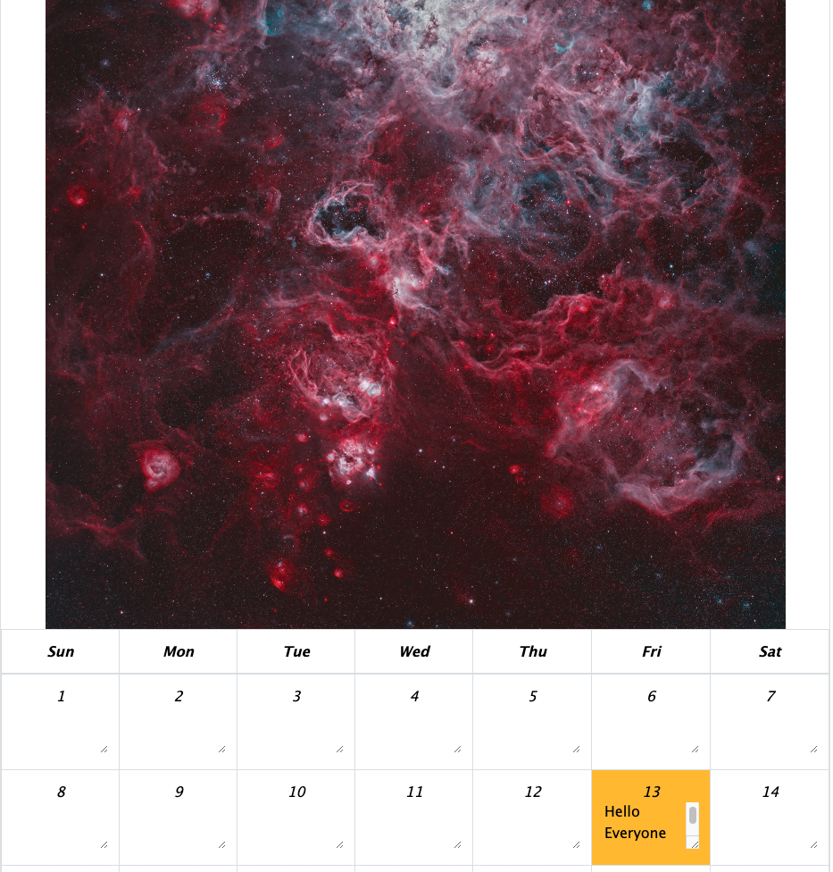
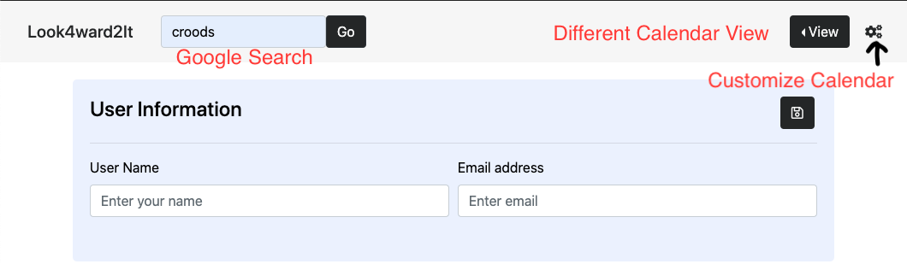
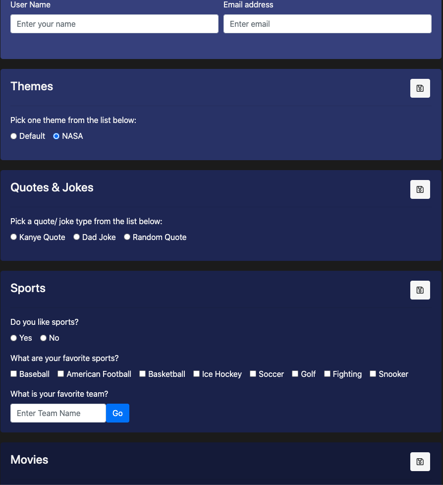
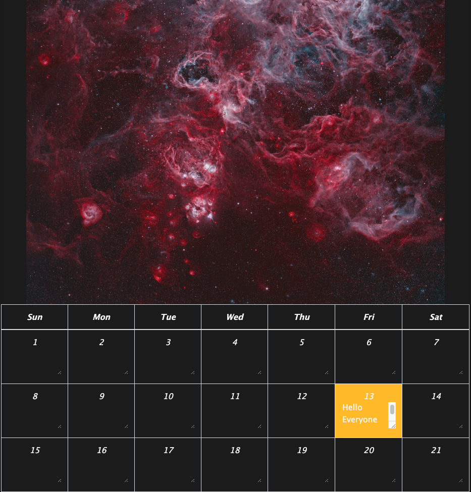

# Look4ward2It - Project1WIP

## Team Members
- Ryan Zelazny
- Brianna Hebeler
- Alexander (Zander) Portera
- Justin Rhee

##  Introduction

Our project is a calendar, Look4ward2It, with multiple functions. Just like any other calendars ours can record upcoming events, specify the day of the week, and help users stay on task. We were able to link several APIs so that this calendar can be customiziable . If you're interested in Sports, Movies, and even Astronomy this calendar is for you. 

## How to use

1) Once you get on our website, you can see its just a regular calendar. When you scroll down, you are able to add any upcoming event on a specific date. 

2) If you scroll back up you can see our Nav Bar, we added a Google Showtimes search bar, different calendar view tab, and a dropdown setting where you can customize the calendar. 

3) Enjoy!!

## Tools and APIs
- HTML
- CSS (BootStrap)
- JavaScript
- Moment JS
- Email JS
- Nasa API 
- The Sport DB API
- The Movie DB API
- Kanye API
- icanhazdadjoke API
- Quote Garden API

## Link to Look4wardToIt
